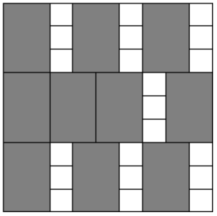

# Бинарный поиск

## Задача №4. Двоичный поиск

Реализуйте алгоритм бинарного поиска.

**Входные данные:**

В первой строке входных данных содержатся натуральные числа 𝑁 и 𝐾 (0<𝑁,𝐾≤100000). Во второй строке задаются 𝑁 элементов первого массива, отсортированного по возрастанию, а в третьей строке – 𝐾 элементов второго массива. Элементы обоих массивов - целые числа, каждое из которых по модулю не превосходит 109

**Выходные данные:**

Требуется для каждого из K чисел вывести в отдельную строку "YES", если это число встречается в первом массиве, и "NO" в противном случае.

### Пример:

| **Входные данные**  |
| ------------------- |
| 10 5                |
| 1 2 3 4 5 6 7 8 9 10|
| **Выходные данные** |
| NO                  |
| NO                  |
| YES                 |
| YES                 |
| NO                  |

### [Решение](binary_search_A/A.cpp)

## Задача №2. Приближенный двоичный поиск

Реализуйте алгоритм приближенного бинарного поиска.

**Входные данные:**

В первой строке входных данных содержатся числа 𝑁 и 𝐾 (0<𝑁,𝐾<100001). Во второй строке задаются 𝑁 чисел первого массива, отсортированного по неубыванию, а в третьей строке – 𝐾 чисел второго массива. Каждое число в обоих массивах по модулю не превосходит $2 \cdot 10^9$.

**Выходные данные:**

Для каждого из 𝐾 чисел выведите в отдельную строку число из первого массива, наиболее близкое к данному. Если таких несколько, выведите меньшее из них.

### Пример:

| **Входные данные**  |
| ------------------- |
| 1 5                 |
| 1 3 5 7 9           |
| 2 4 8 1 6           |
| **Выходные данные** |
| 1                   |
| 3                   |
| 7                   |
| 1                   |
| 5                   |

### [Решение](approximate_binary_search_B/B.cpp)

## Задача №111403. Квадратный корень и квадратный квадрат

Найдите такое число 𝑥, что $x^2 + \sqrt{x} = C$, с точностью не менее 6 знаков после точки.

**Входные данные:**

В единственной строке содержится вещественное число 1.0 ≤ 𝐶 ≤ 1010.

**Выходные данные:**

Выведите одно число — искомый 𝑥.

### Примеры:

| **Входные данные**  |
| ------------------- |
| 2.0000000000        |
| **Выходные данные** |
| 1.000000000         |

| **Входные данные**  |
| ------------------- |
| 18.0000000000       |
| **Выходные данные** |
| 4.000000000         |

### [Решение](real_binary_search_C/C.cpp)

## Задача №3722. Корень кубического уравнения

Дано кубическое уравнение $ax^3 + bx^2 + cx + d = 0$ $(a \neq 0)$. Известно, что у этого уравнения ровно один корень. Требуется его найти.

**Входные данные:**

Во входных данных через пробел записаны четыре целых числа: −1000 ≤ 𝑎,𝑏,𝑐,𝑑 ≤ 1000.

**Выходные данные:**

Выведите единственный корень уравнения с точностью не менее 4 знаков после десятичной точки.

### Примеры:

| **Входные данные**  |
| ------------------- |
| 1 -3 3 -1           |
| **Выходные данные** |
| 0.999999598818135   |

| **Входные данные**  |
| ------------------- |
| -1 -6 -12 -7        |
| **Выходные данные** |
| -0.999999999990564  |

### [Решение](real_binary_search_root_D/D.cpp)

## Задача №1. Коровы - в стойла

На прямой расположены стойла, в которые необходимо расставить коров так, чтобы минимальное расcтояние между коровами было как можно больше.

**Входные данные:**

В первой строке вводятся числа 𝑁 (2<𝑁<10001) – количество стойл и 𝐾 (1<𝐾<𝑁) – количество коров. Во второй строке задаются 𝑁 натуральных чисел в порядке возрастания – координаты стойл (координаты не превосходят $10^9$)

**Выходные данные:**

Выведите одно число – наибольшее возможное допустимое расстояние.

### Пример:

| **Входные данные**  |
| ------------------- |
| 6 3                 |
| 2 5 7 11 15 20      |
| **Выходные данные** |
| 9                   |

### [Решение](cows_in_stalls_E/E.cpp)

## Задача №490. Очень Легкая Задача

Сегодня утром жюри решило добавить в вариант олимпиады еще одну, Очень Легкую Задачу. Ответственный секретарь Оргкомитета напечатал ее условие в одном экземпляре, и теперь ему нужно до начала олимпиады успеть сделать еще N копий. В его распоряжении имеются два ксерокса, один из которых копирует лист за х секунд, а другой – за y. (Разрешается использовать как один ксерокс, так и оба одновременно. Можно копировать не только с оригинала, но и с копии.) Помогите ему выяснить, какое минимальное время для этого потребуется.

**Входные данные:**

На вход программы поступают три натуральных числа N, x и y, разделенные пробелом (1 ≤ N ≤ $2 \cdot 10^8$, 1 ≤ x, y ≤ 10).

**Выходные данные:**

Выведите одно число – минимальное время в секундах, необходимое для получения N копий.

### Примеры:

| **Входные данные**  |
| ------------------- |
| 4 1 1               |
| **Выходные данные** |
| 3                   |

| **Входные данные**  |
| ------------------- |
| 5 1 2               |
| **Выходные данные** |
| 4                   |

### [Решение](very_easy_task_F/F.cpp)

## Задача №111402. Веревочки

С утра шел дождь, и ничего не предвещало беды. Но к обеду выглянуло солнце, и в лагерь заглянула СЭС. Пройдя по всем домикам и корпусам, СЭС вынесла следующий вердикт: бельевые веревки в жилых домиках не удовлетворяют нормам СЭС. Как выяснилось, в каждом домике должно быть ровно по одной бельевой веревке, и все веревки должны иметь одинаковую длину. В лагере имеется 𝑁 бельевых веревок и 𝐾 домиков. Чтобы лагерь не закрыли, требуется так нарезать данные веревки, чтобы среди получившихся веревочек было 𝐾 одинаковой длины. Размер штрафа обратно пропорционален длине бельевых веревок, которые будут развешены в домиках. Поэтому начальство лагеря стремиться максимизировать длину этих веревочек.

**Входные данные:**

В первой строке заданы два числа — 𝑁 (1≤𝑁≤10001) и 𝐾 (1≤𝐾≤10001). Далее в каждой из последующих 𝑁 строк записано по одному числу — длине очередной бельевой веревки. Длина веревки задана в сантиметрах. Все длины лежат в интервале от 1 сантиметра до 100 километров включительно.

**Выходные данные:**

В выходной файл следует вывести одно целое число — максимальную длину веревочек, удовлетворяющую условию, в сантиметрах. В случае, если лагерь закроют, выведите 0.

### Пример:

| **Входные данные**  |
| ------------------- |
| 4 11                |
| 802                 |
| 743                 |
| 457                 |
| 539                 |
| **Выходные данные** |
| 200                 |

### [Решение](ropes_G/G.cpp)

## Задача №1923. Дипломы

Когда Петя учился в школе, он часто участвовал в олимпиадах по информатике, математике и физике. Так как он был достаточно способным мальчиком и усердно учился, то на многих из этих олимпиад он получал дипломы. К окончанию школы у него накопилось 𝑛 дипломов, причём, как оказалось, все они имели одинаковые размеры: 𝑤 — в ширину и ℎ — в высоту. Сейчас Петя учится в одном из лучших российских университетов и живёт в общежитии со своими одногруппниками. Он решил украсить свою комнату, повесив на одну из стен свои дипломы за школьные олимпиады. Так как к бетонной стене прикрепить дипломы достаточно трудно, то он решил купить специальную доску из пробкового дерева, чтобы прикрепить её к стене, а к ней — дипломы. Для того чтобы эта конструкция выглядела более красиво, Петя хочет, чтобы доска была квадратной и занимала как можно меньше места на стене. Каждый диплом должен быть размещён строго в прямоугольнике размером 𝑤 на ℎ. Дипломы запрещается поворачивать на 90 градусов. Прямоугольники, соответствующие различным дипломам, не должны иметь общих внутренних точек. Требуется написать программу, которая вычислит минимальный размер стороны доски, которая потребуется Пете для размещения всех своих дипломов.

**Входные данные:**

Входной файл содержит три целых числа: 𝑤, ℎ, 𝑛 (1≤𝑤,ℎ,𝑛≤$10^9$).

**Выходные данные:**

В выходной файл необходимо вывести ответ на поставленную задачу.

**Иллюстрация к примеру:**

### Примеры:

| **Входные данные**  |
| ------------------- |
| 4 3 10              |
| **Выходные данные** |
| 9                   |

| **Входные данные**  |
| ------------------- |
| 1 1 1               |
| **Выходные данные** |
| 1                   |

### [Решение](diploms_H/H.cpp)
