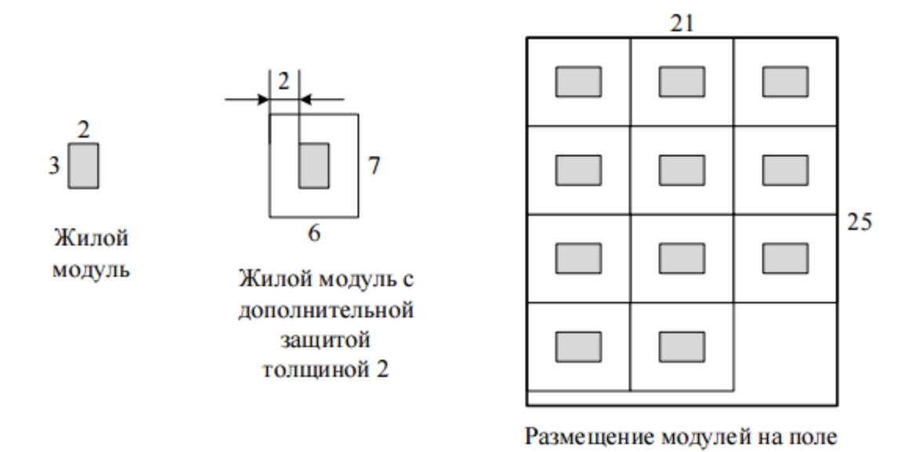

# Бинарный поиск

## Задача №4. Двоичный поиск

Реализуйте алгоритм бинарного поиска.

**Входные данные:**

В первой строке входных данных содержатся натуральные числа 𝑁 и 𝐾 (0 < 𝑁,𝐾 ≤ 100000). Во второй строке задаются 𝑁 элементов первого массива, отсортированного по возрастанию, а в третьей строке – 𝐾 элементов второго массива. Элементы обоих массивов - целые числа, каждое из которых по модулю не превосходит $10^9$

**Выходные данные:**

Требуется для каждого из K чисел вывести в отдельную строку "YES", если это число встречается в первом массиве, и "NO" в противном случае.

### Пример:

| **Входные данные**  |
| ------------------- |
| 10 5                |
| 1 2 3 4 5 6 7 8 9 10|
| **Выходные данные** |
| NO                  |
| NO                  |
| YES                 |
| YES                 |
| NO                  |

### [Решение](binary_search_A/A.cpp)

## Задача №2. Приближенный двоичный поиск

Реализуйте алгоритм приближенного бинарного поиска.

**Входные данные:**

В первой строке входных данных содержатся числа 𝑁 и 𝐾 (0 < 𝑁,𝐾 < 100001). Во второй строке задаются 𝑁 чисел первого массива, отсортированного по неубыванию, а в третьей строке – 𝐾 чисел второго массива. Каждое число в обоих массивах по модулю не превосходит $2 \cdot 10^9$.

**Выходные данные:**

Для каждого из 𝐾 чисел выведите в отдельную строку число из первого массива, наиболее близкое к данному. Если таких несколько, выведите меньшее из них.

### Пример:

| **Входные данные**  |
| ------------------- |
| 1 5                 |
| 1 3 5 7 9           |
| 2 4 8 1 6           |
| **Выходные данные** |
| 1                   |
| 3                   |
| 7                   |
| 1                   |
| 5                   |

### [Решение](approximate_binary_search_B/B.cpp)

## Задача №111403. Квадратный корень и квадратный квадрат

Найдите такое число 𝑥, что $x^2 + \sqrt{x} = C$, с точностью не менее 6 знаков после точки.

**Входные данные:**

В единственной строке содержится вещественное число 1.0 ≤ 𝐶 ≤ 1010.

**Выходные данные:**

Выведите одно число — искомый 𝑥.

### Примеры:

| **Входные данные**  |
| ------------------- |
| 2.0000000000        |
| **Выходные данные** |
| 1.000000000         |

| **Входные данные**  |
| ------------------- |
| 18.0000000000       |
| **Выходные данные** |
| 4.000000000         |

### [Решение](real_binary_search_C/C.cpp)

## Задача №3722. Корень кубического уравнения

Дано кубическое уравнение $ax^3 + bx^2 + cx + d = 0$ $(a \neq 0)$. Известно, что у этого уравнения ровно один корень. Требуется его найти.

**Входные данные:**

Во входных данных через пробел записаны четыре целых числа: −1000 ≤ 𝑎,𝑏,𝑐,𝑑 ≤ 1000.

**Выходные данные:**

Выведите единственный корень уравнения с точностью не менее 4 знаков после десятичной точки.

### Примеры:

| **Входные данные**  |
| ------------------- |
| 1 -3 3 -1           |
| **Выходные данные** |
| 0.999999598818135   |

| **Входные данные**  |
| ------------------- |
| -1 -6 -12 -7        |
| **Выходные данные** |
| -0.999999999990564  |

### [Решение](real_binary_search_root_D/D.cpp)

## Задача №1. Коровы - в стойла

На прямой расположены стойла, в которые необходимо расставить коров так, чтобы минимальное расcтояние между коровами было как можно больше.

**Входные данные:**

В первой строке вводятся числа 𝑁 (2<𝑁<10001) – количество стойл и 𝐾 (1 < 𝐾 < 𝑁) – количество коров. Во второй строке задаются 𝑁 натуральных чисел в порядке возрастания – координаты стойл (координаты не превосходят $10^9$)

**Выходные данные:**

Выведите одно число – наибольшее возможное допустимое расстояние.

### Пример:

| **Входные данные**  |
| ------------------- |
| 6 3                 |
| 2 5 7 11 15 20      |
| **Выходные данные** |
| 9                   |

### [Решение](cows_in_stalls_E/E.cpp)

## Задача №490. Очень Легкая Задача

Сегодня утром жюри решило добавить в вариант олимпиады еще одну, Очень Легкую Задачу. Ответственный секретарь Оргкомитета напечатал ее условие в одном экземпляре, и теперь ему нужно до начала олимпиады успеть сделать еще N копий. В его распоряжении имеются два ксерокса, один из которых копирует лист за х секунд, а другой – за y. (Разрешается использовать как один ксерокс, так и оба одновременно. Можно копировать не только с оригинала, но и с копии.) Помогите ему выяснить, какое минимальное время для этого потребуется.

**Входные данные:**

На вход программы поступают три натуральных числа N, x и y, разделенные пробелом (1 ≤ N ≤ $2 \cdot 10^8$, 1 ≤ x, y ≤ 10).

**Выходные данные:**

Выведите одно число – минимальное время в секундах, необходимое для получения N копий.

### Примеры:

| **Входные данные**  |
| ------------------- |
| 4 1 1               |
| **Выходные данные** |
| 3                   |

| **Входные данные**  |
| ------------------- |
| 5 1 2               |
| **Выходные данные** |
| 4                   |

### [Решение](very_easy_task_F/F.cpp)

## Задача №111402. Веревочки

С утра шел дождь, и ничего не предвещало беды. Но к обеду выглянуло солнце, и в лагерь заглянула СЭС. Пройдя по всем домикам и корпусам, СЭС вынесла следующий вердикт: бельевые веревки в жилых домиках не удовлетворяют нормам СЭС. Как выяснилось, в каждом домике должно быть ровно по одной бельевой веревке, и все веревки должны иметь одинаковую длину. В лагере имеется 𝑁 бельевых веревок и 𝐾 домиков. Чтобы лагерь не закрыли, требуется так нарезать данные веревки, чтобы среди получившихся веревочек было 𝐾 одинаковой длины. Размер штрафа обратно пропорционален длине бельевых веревок, которые будут развешены в домиках. Поэтому начальство лагеря стремиться максимизировать длину этих веревочек.

**Входные данные:**

В первой строке заданы два числа — 𝑁 (1 ≤ 𝑁 ≤ 10001) и 𝐾 (1 ≤ 𝐾 ≤ 10001). Далее в каждой из последующих 𝑁 строк записано по одному числу — длине очередной бельевой веревки. Длина веревки задана в сантиметрах. Все длины лежат в интервале от 1 сантиметра до 100 километров включительно.

**Выходные данные:**

В выходной файл следует вывести одно целое число — максимальную длину веревочек, удовлетворяющую условию, в сантиметрах. В случае, если лагерь закроют, выведите 0.

### Пример:

| **Входные данные**  |
| ------------------- |
| 4 11                |
| 802                 |
| 743                 |
| 457                 |
| 539                 |
| **Выходные данные** |
| 200                 |

### [Решение](ropes_G/G.cpp)

## Задача №1923. Дипломы

Когда Петя учился в школе, он часто участвовал в олимпиадах по информатике, математике и физике. Так как он был достаточно способным мальчиком и усердно учился, то на многих из этих олимпиад он получал дипломы. К окончанию школы у него накопилось 𝑛 дипломов, причём, как оказалось, все они имели одинаковые размеры: 𝑤 — в ширину и ℎ — в высоту. Сейчас Петя учится в одном из лучших российских университетов и живёт в общежитии со своими одногруппниками. Он решил украсить свою комнату, повесив на одну из стен свои дипломы за школьные олимпиады. Так как к бетонной стене прикрепить дипломы достаточно трудно, то он решил купить специальную доску из пробкового дерева, чтобы прикрепить её к стене, а к ней — дипломы. Для того чтобы эта конструкция выглядела более красиво, Петя хочет, чтобы доска была квадратной и занимала как можно меньше места на стене. Каждый диплом должен быть размещён строго в прямоугольнике размером 𝑤 на ℎ. Дипломы запрещается поворачивать на 90 градусов. Прямоугольники, соответствующие различным дипломам, не должны иметь общих внутренних точек. Требуется написать программу, которая вычислит минимальный размер стороны доски, которая потребуется Пете для размещения всех своих дипломов.

**Входные данные:**

Входной файл содержит три целых числа: 𝑤, ℎ, 𝑛 (1 ≤ 𝑤,ℎ,𝑛 ≤ $10^9$).

**Выходные данные:**

В выходной файл необходимо вывести ответ на поставленную задачу.

**Иллюстрация к примеру:**

### Примеры:

| **Входные данные**  |
| ------------------- |
| 4 3 10              |
| **Выходные данные** |
| 9                   |

| **Входные данные**  |
| ------------------- |
| 1 1 1               |
| **Выходные данные** |
| 1                   |

### [Решение](diploms_H/H.cpp)

# Дополнительные задания:

## Задача №742. Массивы

Дано два массива. Для каждого элемента второго массива определите, сколько раз он встречается в первом массиве.

**Входные данные:**

Первая строка входных данных содержит одно число N (1 ≤ N ≤ $10^5$) – количество элементов в первом массиве. Далее идет N целых чисел, не превосходящих по модулю $10^9$ – элементы первого массива, Далее идет количество элементов M во втором массиве и M элементов второго массива с такими же ограничениями.

**Выходные данные:**

Выведите M чисел: для каждого элемента второго массива выведите, сколько раз такое значение встречается в первом массиве.

### Пример:

| **Входные данные**  |
| ------------------- |
| 3                   |
| 1 2 1               |
| 4                   |
| 0 1 2 3             |
| **Выходные данные** |
| 0 2 1 0             |

### [Решение](massives_I/I.cpp)

## Задача №113097. Космическое поселение

Для освоения Марса требуется построить исследовательскую базу. База должна состоять из 𝑛 одинаковых модулей, каждый из которых представляет собой прямоугольник.

Каждый модуль представляет собой жилой отсек, который имеет форму прямоугольника размером $𝑎 \times 𝑏$ метров. Для повышения надежности модулей инженеры могут добавить вокруг каждого модуля слой дополнительной защиты. Толщина этого слоя должна составлять целое число метров, и все модули должны иметь одинаковую толщину дополнительной защиты. Модуль с защитой, толщина которой равна 𝑑 метрам, будет иметь форму прямоугольника размером $(a + 2d) \times (b+2d)$ метров.

Все модули должны быть расположены на заранее подготовленном прямоугольном поле размером 𝑤×ℎ метров. При этом они должны быть организованы в виде регулярной сетки: их стороны должны быть параллельны сторонам поля, и модули должны быть ориентированы одинаково.

Требуется написать программу, которая по заданным количеству и размеру модулей, а также размеру поля для их размещения, определяет максимальную толщину слоя дополнительной защиты, который можно добавить к каждому модулю.

**Входные данные:**

Строка содержит пять разделенных пробелами целых чисел: 𝑛, 𝑎, 𝑏, 𝑤 и ℎ (1 ≤ 𝑛,𝑎,𝑏,𝑤,ℎ ≤ $10^{18}$ ). Гарантируется, что без дополнительной защиты все модули можно разместить в поселении описанным образом.

**Выходные данные:**

Ответ должен содержать одно целое число: максимальную возможную толщину дополнительной защиты. Если дополнительную защиту установить не удастся, требуется вывести число 0.

**Пояснения к примерам:**

В первом примере можно установить дополнительную защиту толщиной 2 метра и разместить модули на поле, как показано на рисунке.

Во втором примере жилой отсек имеет размер 5×5 метров, а поле – размер 6×6 метров. Добавить дополнительную защиту к модулю нельзя.

**Описание подзадач и системы оценивания:**

**Подзадача 1 (26 баллов)**

1 ≤ 𝑛 ≤ 1000, 1 ≤ 𝑎,𝑏,𝑤,ℎ ≤ 1000.

Баллы за подзадачу начисляются только в случае, если все тесты успешно пройдены

**Подзадача 2 (23 балла)**

1 ≤ 𝑛 ≤ 1000, 1 ≤ 𝑎,𝑏,𝑤,ℎ ≤ $10^9$.

Баллы за подзадачу начисляются только в случае, если все тесты успешно пройдены.

**Подзадача 3 (до 24 баллов)**

1 ≤ 𝑛 ≤ $10^9$, 1 ≤ 𝑎,𝑏,𝑤,ℎ ≤ $10^{18}$.

В этой подзадаче 8 тестов, каждый тест оценивается в 3 балла. Баллы за каждый тест начисляются независимо.

**Подзадача 4 (до 27 баллов)**

1 ≤ 𝑛 ≤ $10^{18}$, 1 ≤ 𝑎,𝑏,𝑤,ℎ ≤ $10^{18}$.

В этой подзадаче 9 тестов, каждый тест оценивается в 3 балла. Баллы за каждый тест начисляются независимо.

### Примеры:

| **Входные данные**  |
| ------------------- |
| 11 2 31 21 25       |
| **Выходные данные** |
| 2                   |

| **Входные данные**  |
| ------------------- |
| 1 5 5 6 6           |
| **Выходные данные** |
| 0                   |

### [Решение](space_colony_J/J.cpp)

## Задача №586. Детский праздник

Организаторы детского праздника планируют надуть для него 𝑀 воздушных шариков. С этой целью они пригласили 𝑁 добровольных помощников, $i$-й среди которых надувает шарик за $T_i$ минут, однако каждый раз после надувания $Z_i$ шариков устает и отдыхает $Y_i$ минут. Теперь организаторы праздника хотят узнать, через какое время будут надуты все шарики при наиболее оптимальной работе помощников, и сколько шариков надует каждый из них. (Если помощник надул шарик, и должен отдохнуть, но больше шариков ему надувать не придется, то считается, что он закончил работу сразу после окончания надувания последнего шарика, а не после отдыха).

**Входные данные:**

В первой строке входных данных задаются числа 𝑀 и 𝑁 (0 <= 𝑀 <= 15000, 1 <= 𝑁 <= 1000). Следующие 𝑁 строк содержат по три целых числа - $T_i$, $Z_i$ и $Y_i$ соответственно (1 <= $T_i$, $Y_i$ <= 100, 1 <= $Z_i$ <= 1000).

**Выходные данные:**

Выведите в первой строке число $T$ - время, за которое будут надуты все шарики. Во второй строке выведите 𝑁 чисел - количество шариков, надутых каждым из приглашенных помощников. Разделяйте числа пробелами. Если распределений шариков несколько, выведите любое из них.

### Примеры:

| **Входные данные**  |
| ------------------- |
| 2 2                 |
| 1 1 1               |
| 1 1 1               |
| **Выходные данные** |
| 1                   |
| 1 1                 |

| **Входные данные**  |
| ------------------- |
| 3 2                 |
| 2 2 5               |
| 1 1 10              |
| **Выходные данные** |
| 4                   |
| 2 1                 |

### [Решение](kids_holiday_K/K.cpp)

## Задача №1620. Субботник

В классе учатся N человек. Классный руководитель получил указание направить на субботник R бригад по С человек в каждой.

Все бригады на субботнике будут заниматься переноской бревен. Каждое бревно одновременно несут все члены одной бригады. При этом бревно нести тем удобнее, чем менее различается рост членов этой бригады.

Числом неудобства бригады будем называть разность между ростом самого высокого и ростом самого низкого членов этой бригады (если в бригаде только один человек, то эта разница равна 0). Классный руководитель решил сформировать бригады так, чтобы максимальное из чисел неудобства сформированных бригад было минимально. Помогите ему в этом!

Рассмотрим следующий пример. Пусть в классе 8 человек, рост которых в сантиметрах равен 170, 205, 225, 190, 260, 130, 225, 160, и необходимо сформировать две бригады по три человека в каждой. Тогда одним из вариантов является такой:

1 бригада: люди с ростом 225, 205, 225

2 бригада: люди с ростом 160, 190, 170

При этом число неудобства первой бригады будет равно 20, а число неудобства второй — 30. Максимальное из чисел неудобств будет 30, и это будет наилучший возможный результат.

*Формат входных данных:*

Сначала вводятся натуральные числа N, R и C — количество человек в классе, количество бригад и количество человек в каждой бригаде (1 ≤ $R \cdot C$ ≤ N ≤ 100 000). Далее вводятся N целых чисел — рост каждого из N учеников. Рост ученика — натуральное число, не превышающее 1 000 000 000.

*Формат выходных данных:*

Выведите одно число — наименьше возможное значение максимального числа неудобства сформированных бригад.

### Пример:

| **Входные данные**  |
| ------------------- |
| 8 2 3               |
| 170                 |
| 205                 |
| 225                 |
| 190                 |
| 260                 |
| 130                 |
| 225                 |
| 160                 |
| **Выходные данные** |
| 30                  |

### [Решение](saturday_L/L.cpp)

## Задача №672. Провода

Дано N отрезков провода длиной $L_1$, $L_2$, ..., $L_N$ сантиметров. Требуется с помощью разрезания получить из них K равных отрезков как можно большей длины, выражающейся целым числом сантиметров. Если нельзя получить K отрезков длиной даже 1 см, вывести 0.

Ограничения: 1 <= N <= 10 000, 1 <= K <= 10 000, 100 <= $L_i$ <= 10 000 000, все числа целые.

**Входные данные:**

В первой строке находятся числа N и К. В следующих N строках - $L_1$, $L_2$, ..., $L_N$, по одному числу в строке.

**Выходные данные:**

Вывести одно число - полученную длину отрезков.

### Пример:

| **Входные данные**  |
| ------------------- |
| 4 11                |
| 802                 |
| 743                 |
| 457                 |
| 539                 |
| **Выходные данные** |
| 200                 |

### [Решение](wires_M/M.cpp)

## Задача №112749. Вырубка леса

Фермер Николай нанял двух лесорубов: Дмитрия и Федора, чтобы вырубить лес, на месте которого должно быть кукурузное поле. В лесу растут 𝑋 деревьев.

Дмитрий срубает по A деревьев в день, но каждый 𝐾-й день он отдыхает и не срубает ни одного дерева. Таким образом, Дмитрий отдыхает в 𝐾-й, 2𝐾-й, 3𝐾-й день, и т.д.

Федор срубает по B деревьев в день, но каждый 𝑀-й день он отдыхает и не срубает ни одного дерева. Таким образом, Федор отдыхает в 𝑀-й, 2𝑀-й, 3𝑀-й день, и т.д.

Лесорубы работают параллельно и, таким образом, в дни, когда никто из них не отдыхает, они срубают 𝐴 + 𝐵 деревьев, в дни, когда отдыхает только Федор — 𝐴 деревьев, а в дни, когда отдыхает только Дмитрий — 𝐵 деревьев. В дни, когда оба лесоруба отдыхают, ни одно дерево не срубается.

Фермер Николай хочет понять, за сколько дней лесорубы срубят все деревья, и он сможет засеять кукурузное поле.

Требуется написать программу, которая по заданным целым числам 𝐴, 𝐾, 𝐵, 𝑀 и 𝑋 определяет, за сколько дней все деревья в лесу будут вырублены.

**Входные данные:**

Входной файл содержит пять целых чисел, разделенных пробелами: 𝐴, 𝐾, 𝐵, 𝑀 и 𝑋 (1 ≤ 𝐴, 𝐵 ≤ $10^9$ , 2 ≤ 𝐾, 𝑀 ≤ $10^{18}$, 1 ≤ 𝑋 ≤ $10^{18}$).

**Выходные данные:**

Выходной файл должен содержать одно целое число — искомое количество дней.

**Пояснения к примеру:**

В приведенном примере лесорубы вырубают 25 деревьев за 7 дней следующим образом:

* 1-й день: Дмитрий срубает 2 дерева, Федор срубает 3 дерева, итого 5 деревьев;
* 2-й день: Дмитрий срубает 2 дерева, Федор срубает 3 дерева, итого 10 деревьев;
* 3-й день: Дмитрий срубает 2 дерева, Федор отдыхает, итого 12 деревьев;
* 4-й день: Дмитрий отдыхает, Федор срубает 3 дерева, итого 15 деревьев;
* 5-й день: Дмитрий срубает 2 дерева, Федор срубает 3 дерева, итого 20 деревьев;
* 6-й день: Дмитрий срубает 2 дерева, Федор отдыхает, итого 22 дерева;
* 7-й день: Дмитрий срубает 2 дерева, Федор срубает оставшееся 1 дерево, итого все 25 деревьев срублены.

Внимание! Тест из примера не подходит под ограничения для подзадач 2 и 3, но решение принимается на проверку только в том случае, если оно выводит правильный ответ на тесте из примера. Решение должно выводить правильный ответ на тест даже, если оно рассчитано на решение только каких-либо из подзадач 2 и 3

**Система оценки и описание подзадач:**

**Подзадача 1 (32 балла)**

1 ≤ 𝑋 ≤ 1000, 1 ≤ 𝐴, 𝐵 ≤ 1000, 2 ≤ 𝐾, 𝑀 ≤ 1000

Баллы за подзадачу начисляются только в случае, если все тесты успешно пройдены.

**Подзадача 2 (10 баллов)**

1 ≤ 𝑋 ≤ $10^{18}$

𝑋 < 𝐾

𝑋 < 𝑀

При решении этой подзадачи можно считать, что лесорубы не отдыхают.

Баллы за подзадачу начисляются только в случае, если все тесты успешно пройдены.

**Подзадача 3 (10 баллов)**

1 ≤ 𝑋 ≤ $10^{18}$

Дополнительно к приведенным ограничениям выполняется условие 𝐾 = 𝑀.

Баллы за подзадачу начисляются только в случае, если все тесты успешно пройдены.

**Подзадача 4 (48 баллов)**

1 ≤ 𝑋 ≤ $10^{18}$, 1 ≤ 𝐴, 𝐵 ≤ $10^{9}$, 2 ≤ 𝐾, 𝑀 ≤ $10^{18}$

В этой подзадаче 16 тестов, каждый тест оценивается в 3 балла. Баллы за каждый тест начисляются независимо.

### Пример:

| **Входные данные**  |
| ------------------- |
| 2 4 3 3 25          |
| **Выходные данные** |
| 7                   |

### [Решение](forest_cutting_N/N.cpp)
